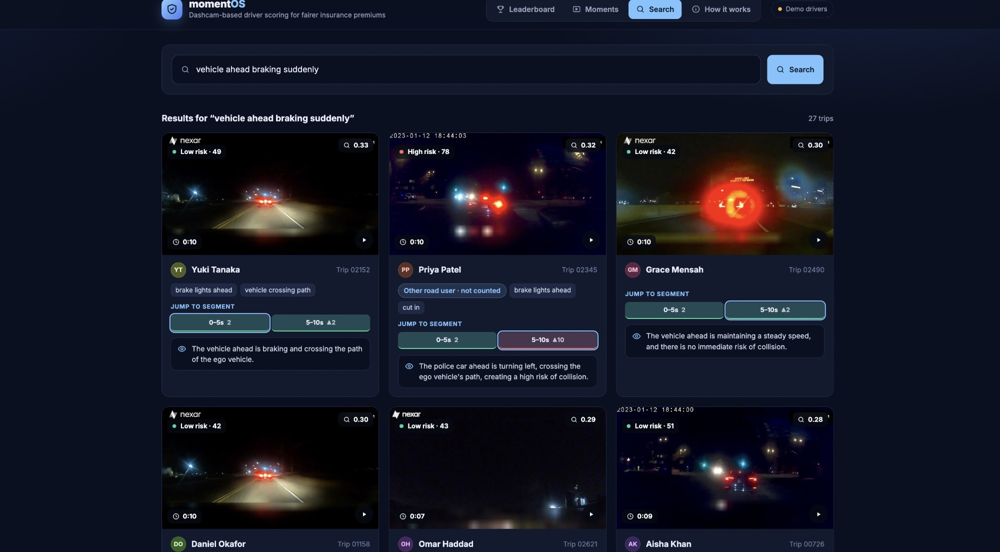
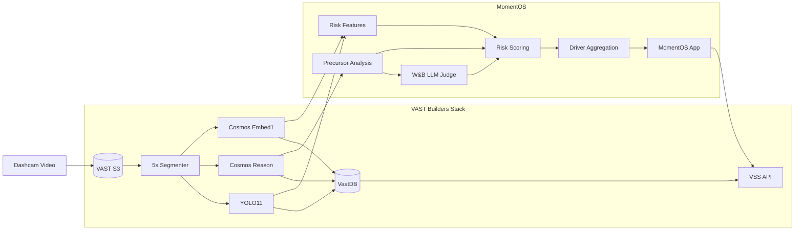

# MomentOS

**A credit-score-like system for driving, built from actual dashcam video history.**

MomentOS turns dashcam footage into an explainable Safe Driving Score. It identifies risky driving precursors, determines whether the risk was caused by the driver or another road user, and connects every score change back to the exact video evidence.

Instead of estimating driving risk from coarse proxies, MomentOS measures what actually happened on the road.

**Live app:** http://team-49-vss.thecosmoslabs.com/app

**Demo video:** https://youtu.be/L6RbEeg6T2Q



> The drivers shown in the demo are simulated groups of anonymous Nexar clips with fictional names, not real people. No location features are used.

---

## What it does

For every dashcam trip, MomentOS looks for risky precursors such as:

- hard braking ahead
- unsafe following distance
- fast closing speed
- vehicle cut-ins
- vehicles crossing the ego path
- pedestrians or cyclists entering the path
- lane drift
- red-light violations
- low time-to-collision

Each event receives a risk score, cause attribution, supporting cues, and a short explanation.

Only events attributed to the **ego driver** affect the driver's Safe Driving Score.

Events caused by another road user are still surfaced as evidence, but do not penalize the driver.

The result is not just:

> Driver score: 82/100

MomentOS can show **why** the score is 82, which moments contributed to it, what happened in those moments, and the video evidence behind every decision.

---

## Why

Insurance risk is often estimated using indirect signals such as claims history, mileage, demographics, or coarse telematics.

Dashcams contain a much richer signal.

MomentOS uses actual driving history to build an evidence-backed risk profile from observable road behavior.

For the current demo, the system is opt-in and can be used to qualify safer drivers for discounts or provide coaching. A score never raises a premium. Score changes require human review, and drivers can contest individual events.

---

## Pipeline

Dashcam footage flows through the VAST Builders stack:

```text
Dashcam Video
     ↓
5-second Segments
     ↓
Cosmos Reason
Risk + Cause + TTC + Driving Cues
     ↓
Cosmos Embed + YOLO11 + W&B LLM
     ↓
Per-Clip Risk Score
     ↓
Driver-Caused Event Filtering
     ↓
Safe Driving Score
     ↓
Evidence + Incident Reports + Coaching
```

The VAST stack handles video ingestion, segmentation, understanding, embedding, object detection, indexing, and retrieval.

MomentOS builds the scoring and decision layer on top.

---

## Risk scoring

Each clip is scored using four independent signals.

| Signal | Weight |
|---|---:|
| Cosmos Reason precursor risk | 0.40 |
| W&B LLM risk judge | 0.25 |
| Cosmos Embed hazard similarity | 0.20 |
| YOLO11 in-path proximity | 0.15 |

The weights were fixed before evaluation and were not fitted using the evaluation labels.

### 1. Cosmos Reason

We prompt Cosmos Reason ([`prompts/precursor_v1.txt`](prompts/precursor_v1.txt)) to analyze the final seconds of each driving segment and return a structured response:

```text
RISK
CAUSE
TTC
LEAD
EGO
CUES
SUMMARY
```

Example cues include:

```text
hard_braking_ahead
cut_in
vehicle_crossing_path
pedestrian_in_path
cyclist_in_path
ego_tailgating
ego_lane_drift
ego_red_light
```

This gives MomentOS both a risk estimate and an explanation of what created that risk.

### 2. Cosmos Embed

Cosmos Embed measures visual similarity between video segments and hazardous driving concepts such as:

```text
vehicle ahead braking suddenly
car cutting into our lane
pedestrian stepping into the road
```

This provides another video-native signal independent of the structured reasoning output.

### 3. YOLO11

YOLO detections are converted into geometric risk features such as:

- proximity to the ego path
- object looming
- vulnerable road users in path

The final portion of each clip receives greater weight because the Nexar clips end immediately before a possible collision event.

### 4. W&B LLM judge

A W&B-hosted LLM independently evaluates the structured segment descriptions and produces an overall clip-level risk estimate.

The four signals are normalized and combined into a final risk score.

---

## Driver scoring

A single risky moment should not define a driver.

MomentOS aggregates events across a driver's video history.

```text
Driver History
      ↓
Risky Moments
      ↓
Cause Attribution
      ↓
Keep Ego-Caused Events
      ↓
Normalize by Number of Trips
      ↓
Safe Driving Score
```

High-risk ego-caused events carry more weight than elevated-risk events.

Events caused by other vehicles, pedestrians, or cyclists do not reduce the driver's score.

Each driver's profile includes:

- Safe Driving Score
- number of analyzed trips
- high-risk driver-caused events
- elevated-risk driver-caused events
- risk caused by other road users
- events per 10 trips
- supporting video clips
- detected risk cues

---

## Explainability

Every score is traceable back to video.

For any flagged event, MomentOS can show:

- the original dashcam clip
- the highest-risk segment
- risk level
- cause attribution
- time-to-collision estimate
- detected cues
- model summary
- generated incident report

MomentOS also uses the VSS synthesis endpoint to generate a driver-facing incident report from the indexed video evidence.

The report describes:

1. what happened
2. contributing factors
3. what the driver could do differently
4. confidence in the available evidence

---

## Contest and human review

Drivers can contest any flagged moment.

When a moment is contested, it is removed from the active driver score while waiting for human review.

Tier changes are therefore not fully automated.

This creates a simple evidence loop:

```text
Model Decision
     ↓
Video Evidence
     ↓
Driver Review
     ↓
Contest if Needed
     ↓
Human Review
```

---

## Evaluation

We evaluated MomentOS on the **Nexar Collision Prediction public test split**.

The evaluation contains:

- **667 clips**
- **334 positive collision / near-collision lead-ups**
- **333 normal driving clips**

A random ranking has an Average Precision of **0.501**.

| Model | AP | ROC AUC |
|---|---:|---:|
| Cosmos Reason precursor | 0.715 | 0.770 |
| W&B LLM judge | 0.698 | 0.746 |
| Cosmos Embed hazard search | 0.643 | 0.666 |
| YOLO in-path features | 0.621 | 0.654 |
| **MomentOS blend** | **0.754** | **0.785** |

The combined system performs better than any individual signal.

Before adding the custom precursor prompt, hazard search over the default VAST captions reached **0.689 AP** on the 590 clips indexed at that point (random AP 0.566 on that subset).

Full results:

- [`results/metrics.md`](results/metrics.md)
- [`results/baseline_search.md`](results/baseline_search.md)
- [`results/submission_public.csv`](results/submission_public.csv)

Weather, lighting, scene, and time-to-accident breakdowns require the gated Nexar metadata files and are therefore not included in this repository.

---

## VAST Builders stack

MomentOS uses the VAST Builders Challenge infrastructure end-to-end.

### VAST DataEngine

Used for:

- video ingestion
- segmentation
- metadata flow
- object detection
- video understanding

### NVIDIA Cosmos Reason

Used to extract structured driving-risk information from every video segment.

### NVIDIA Cosmos Embed1

Used for semantic video retrieval and hazardous-event similarity scoring.

### YOLO11

Used for vehicle and vulnerable-road-user detection and geometric proximity features.

### VastDB

Stores indexed video segments, embeddings, captions, detections, and metadata.

### VSS API

Used by the application for:

- semantic search
- video streaming
- indexed video retrieval
- evidence synthesis

### Weights & Biases Inference

Used for:

- independent clip-level risk judging
- driver coaching generation

The current model is:

```text
Qwen/Qwen3-30B-A3B-Instruct-2507
```

---

## Architecture



More detail is available in [`docs/architecture.md`](docs/architecture.md).

---

## App

The demo application is built with FastAPI and deployed on the challenge Kubernetes infrastructure.

### Leaderboard

Ranks all simulated drivers by Safe Driving Score and shows each driver's premium tier: safe-driver reward (up to 15% off), standard (no change), or free coaching.

### Driver profile

Shows:

- total trips
- Safe Driving Score
- driver tier and premium effect
- ego-caused events
- other-road-user events
- events per 10 trips
- complete supporting history as video cards

### Moments

Lets users browse every trip ranked by risk, filter by risk level, cause, and driver, preview clips on hover, and jump to the riskiest segment.

### Semantic video search

Users can search the indexed driving history in natural language.

Examples:

```text
car cutting into our lane
pedestrian entering the road
driver following too closely
vehicle braking suddenly ahead
```

### Incident reports

MomentOS generates evidence-grounded incident summaries using the corresponding indexed video segments.

### Coaching

The W&B-hosted LLM summarizes repeated ego-caused patterns and generates short coaching recommendations for the driver.

---

## Repository structure

```text
momentOS/
├── app/
│   ├── main.py
│   ├── requirements.txt
│   └── static/
│
├── deploy/
│   ├── deploy.sh
│   └── momentos.yaml
│
├── docs/
│   ├── architecture.md
│   └── images/
│
├── manifests/
│   └── batch_a.csv
│
├── prompts/
│   └── precursor_v1.txt
│
├── results/
│   ├── baseline_search.md
│   ├── clip_scores.csv
│   ├── metrics.md
│   └── submission_public.csv
│
├── scripts/
│   ├── baseline_search.py
│   ├── build_app_data.py
│   ├── build_manifest.py
│   ├── fill_features.py
│   ├── llm_judge.py
│   ├── precursor_run.py
│   ├── prompt_probe.py
│   ├── reingest_batch.py
│   ├── risk_parse.py
│   ├── score.py
│   ├── vdb.py
│   ├── vss.py
│   └── wandb_llm.py
│
├── .cursor/skills/momentos/   # how we drove the pipeline
├── config.example
├── LICENSE
├── NOTICE.md
├── SUBMISSION.md
└── README.md
```

---

## Reproduce

Credentials come from `/config/<team>.config` on a Builders Challenge VM.

Environment variable names are listed in [`config.example`](config.example).

```bash
uv venv .venv

uv pip install \
  --python .venv/bin/python \
  vastdb \
  pyarrow \
  numpy \
  pandas \
  boto3 \
  scikit-learn \
  httpx \
  fastapi \
  uvicorn
```

Build the clip manifest:

```bash
.venv/bin/python scripts/build_manifest.py
```

Add the public Nexar labels locally (columns `id,target`, gitignored):

```text
data/nexar/labels_public.csv
```

The dataset itself is not committed to this repository.

Run the pipeline:

```bash
.venv/bin/python scripts/precursor_run.py prompts/precursor_v1.txt

.venv/bin/python scripts/fill_features.py

.venv/bin/python scripts/llm_judge.py

.venv/bin/python scripts/score.py

.venv/bin/python scripts/build_app_data.py
```

Deploy:

```bash
KUBECTL=~/.local/bin/kubectl deploy/deploy.sh
```

---

## Build-day note

The shared ingestion pipeline had a large backlog during the challenge.

A complete re-ingestion of all 667 clips would not have completed within the event window, so MomentOS called Cosmos Reason directly for precursor analysis while also supporting the standard VSS re-ingestion path.

We also found that VSS `/search` requests with `top_k=100` could exceed the backend's 4 GiB memory limit. The application therefore uses `top_k <= 40`.

---

## Dataset

MomentOS is evaluated using the Nexar Collision Prediction dataset:

> Moura, Daniel C., and Zvitia, Orly.
> **Nexar Collision Dataset.**
> Hugging Face, 2025.

https://huggingface.co/datasets/nexar-ai/nexar_collision_prediction

The dataset itself is not redistributed in this repository.

The demo uses anonymous clips grouped into simulated driver histories. It does not attempt to identify drivers, vehicles, faces, license plates, or locations.

See [`NOTICE.md`](NOTICE.md) for dataset licensing and ethical-use restrictions.

---

## Built at VAST Builders Challenge

Built using:

- VAST DataEngine
- VastDB
- NVIDIA Cosmos Reason
- NVIDIA Cosmos Embed1
- YOLO11
- VSS
- Weights & Biases Inference
- FastAPI

Code is licensed under [Apache 2.0](LICENSE).
