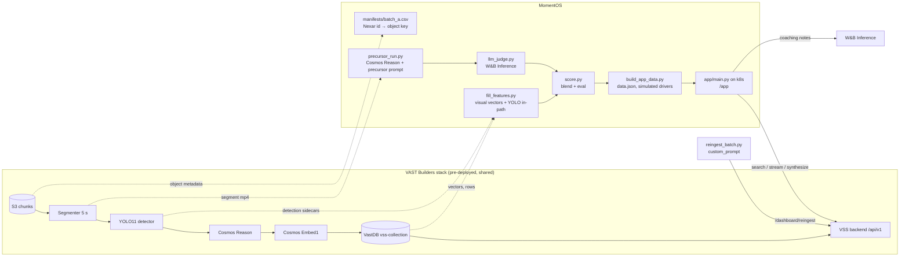

# MomentOS architecture

## Data flow

1. **Scope.** `build_manifest.py` selects batch A by upload time from S3 object metadata and maps each
   upload to its Nexar id (`original-filename`). Tags are never read: they carry labels.
2. **Precursor captions.** `precursor_run.py` sends every batch-A segment (5 s mp4 from the segments
   bucket) to Cosmos Reason with `prompts/precursor_v1.txt`, giving a parseable
   `RISK/CAUSE/TTC/LEAD/EGO/CUES/SUMMARY` answer. `reingest_batch.py` sends the same prompt through
   the pipeline so search and `/videos/synthesize` use it too.
3. **Perception features.** `fill_features.py` reuses VastDB visual vectors and the detector's bbox
   sidecars; segments the index never wrote are embedded directly with the same model.
4. **LLM judge.** `llm_judge.py` asks a W&B-hosted LLM for an overall clip risk and cause from the
   segment answers.
5. **Score and evaluate.** `score.py` blends the four signals with fixed weights and evaluates against
   the public labels kept in gitignored `data/`.
6. **App.** `build_app_data.py` bakes label-free clip data and simulated drivers into
   `app/static/data.json`; `deploy/deploy.sh` ships the app as a ConfigMap on `python:3.12-slim`.

## App API (served under `/app`)

| Route | Purpose |
|---|---|
| `GET /api/overview` | drivers with safe-driving scores, tiers, flagged-moment counts |
| `GET /api/riders/{id}` | one driver's moments; `POST …/coach` writes a W&B coaching note |
| `GET /api/clips`, `GET /api/clips/{id}` | ranked moments; per-segment cues, cause, TTC |
| `GET /api/stream/{id}?seg=n` | range-capable playback proxy (VSS token stays server-side; allowlisted sources only) |
| `POST /api/clips/{id}/report` | incident note via VSS `/videos/synthesize` with a driver-facing system prompt |
| `POST /api/clips/{id}/contest` | contest or withdraw; contested moments leave the score pending human review |
| `GET /api/search?q=` | VSS hybrid search restricted to the batch-A upload window and manifest |

## Known stack behaviour (build day)

- Backend `/search` with `top_k=100` coincided with an OOM kill (exit 137, 4 GiB limit); MomentOS uses ≤40.
- Re-ingest job progress lives in one backend worker's memory; status polls can 404 on another worker.
- The VastDB writer stopped receiving events for stretches while the shared backlog was large.
- App pods cannot resolve the public ingress hostname; `deploy/deploy.sh` points `VSS_URL` at the in-cluster `video-backend-service`.
